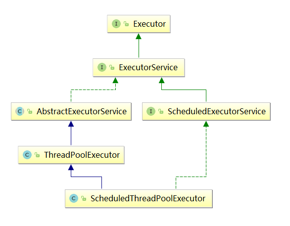

## java.util.concurrent
http://docs.oracle.com/javase/7/docs/api/java/util/concurrent/package-summary.html

### Executors

Java中的线程即是工作单元也是执行机制，从JDK 5后，工作单元与执行机制被分离。工作单元包括Runnable和Callable，执行机制由JDK 5中增加的java.util.concurrent包中Executor框架提供。

Executor框架主要包含三个部分：

任务：包括Runnable和Callable，其中Runnable表示一个可以异步执行的任务，而Callable表示一个会产生结果的任务

任务的执行：包括Executor框架的核心接口Executor以及其子接口ExecutorService。在Executor框架中有两个关键类ThreadPoolExecutor和ScheduledThreadPoolExecutor实现了ExecutorService接口。

异步计算的结果：包括接口Future和其实现类FutureTask。

```
Executor：一个接口，其定义了一个接收Runnable对象的方法executor，其方法签名为executor(Runnable command),
ExecutorService：是一个比Executor使用更广泛的子类接口，其提供了生命周期管理的方法，以及可跟踪一个或多个异步任务执行状况返回Future的方法
AbstractExecutorService：ExecutorService执行方法的默认实现
ThreadPoolExecutor：线程池，可以通过调用Executors以下静态工厂方法来创建线程池并返回一个ExecutorService对象：

ScheduledExecutorService：一个可定时调度任务的接口
ScheduledThreadPoolExecutor：ScheduledExecutorService的实现，一个可定时调度任务的线程池
```

1. Executor可以很轻易的实现各种调优  管理  监视  记录日志和错误报告等待
2. ExecutorService提供了管理Eecutor生命周期的方法，ExecutorService的生命周期包括了：运行  关闭和终止三种状态。
    1. ExecutorService在初始化创建时处于运行状态。
    2. shutdown方法等待提交的任务执行完成并不再接受新任务，在完成全部提交的任务后关闭
    3. shutdownNow方法将强制终止所有运行中的任务并不再允许提交新任务
3. ExecutorCompletionService:实现了CompletionService，将执行完成的任务放到阻塞队列中，通过take或poll方法来获得执行结果


### Concurrent Collections:并发容器
http://raychase.iteye.com/blog/1998965

#### Queues
```
Ctrl+Alt+Shift+U, 邮件菜单show implementations勾选子类

Queue的子类
    AsLIFOQueue在Collections (java.util)
    AbstractQueue (java.util)
            AsLIFOQueue在Collections (java.util)
            ArrayBlockingQueue (java.util.concurrent)
            DelayedWorkQueue在ScheduledThreadPoolExecutor (java.util.concurrent)
            LinkedTransferQueue (java.util.concurrent)
            SynchronousQueue (java.util.concurrent)
            PriorityQueue (java.util)
            LinkedBlockingDeque (java.util.concurrent)
            DelayQueue (java.util.concurrent)
            LinkedBlockingQueue (java.util.concurrent)
            ConcurrentLinkedQueue (java.util.concurrent)
            PriorityBlockingQueue (java.util.concurrent)
    BlockingQueue (java.util.concurrent)
            ArrayBlockingQueue (java.util.concurrent)
            DelayedWorkQueue在ScheduledThreadPoolExecutor (java.util.concurrent)
            SynchronousQueue (java.util.concurrent)
            BlockingDeque (java.util.concurrent)
            DelayQueue (java.util.concurrent)
            FairBlockingQueue (org.apache.tomcat.jdbc.pool)
            TransferQueue (java.util.concurrent)
            LinkedBlockingQueue (java.util.concurrent)
            MultiLockFairBlockingQueue (org.apache.tomcat.jdbc.pool)
            PriorityBlockingQueue (java.util.concurrent)
    Deque (java.util)
            BlockingDeque (java.util.concurrent)
            LinkedList (java.util)
            ArrayDeque (java.util)
            IdentityLinkedList (sun.awt.util)
            ConcurrentLinkedDeque (java.util.concurrent)
    ConcurrentLinkedQueue (java.util.concurrent)
    
```

##### 常用：
##### ArrayBlockingQueue：一个由数组结构组成的有界阻塞队列。
1. 通过数组来存储，定义好后，不可扩展
2. 通过ReentrantLock来保证线程安全，所有的进出队列都需要加锁
3. put,task阻塞等待是通过lock.lockInterrupted()来实现的，没获取到lock就一直阻塞
4. lock.newCondition来唤醒等待的队列（到时候看到lock的时候再理解一下这里如何阻塞，如何通知的逻辑？）

##### LinkedBlockingQueue：一个由链表结构组成的有界阻塞队列。
1. 可指定链表长度
2. 读写锁(takeLock,putLock)分开，可提高并发
3. 头部取完数据后，first.item = null;把数据设置为null，让GC回收

 
##### PriorityBlockingQueue：一个支持优先级排序的无界阻塞队列。
1. 数组的二叉树比较的实现

 
DealyQueue：一个使用优先级队列实现的无界阻塞队列。 
SynchronousQueue：一个不存储元素的阻塞队列。 
LinkedTransferQueue：一个由链表结构组成的无界阻塞队列。 
LinkedBlockingDeque：一个由链表结构组成的双向阻塞队列。


### LOCK
#### 线程通信：lock.newCondition 对比 synchronized/wait()

### Timing

### Synchronizers


### Memory Consistency Properties